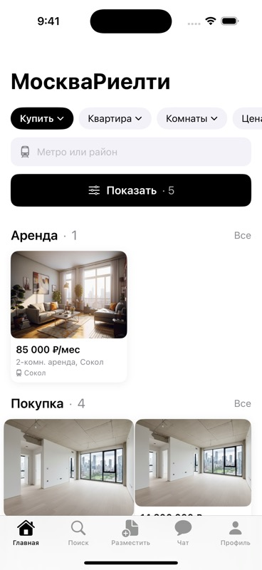
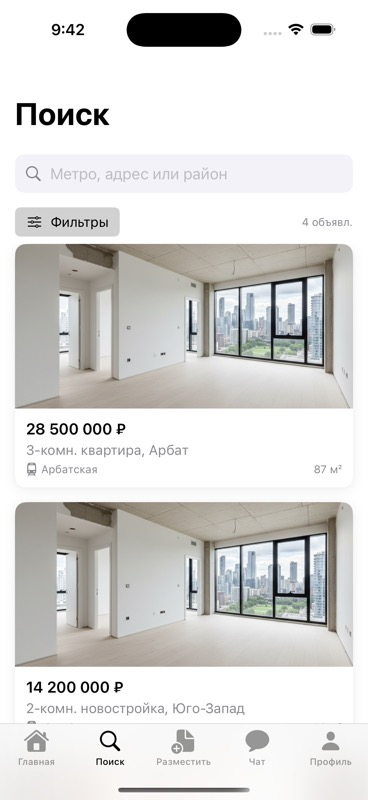
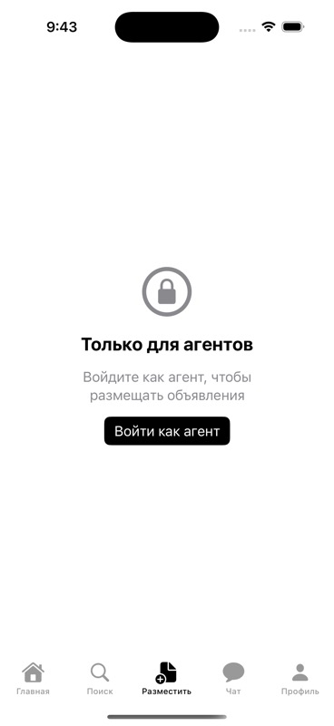
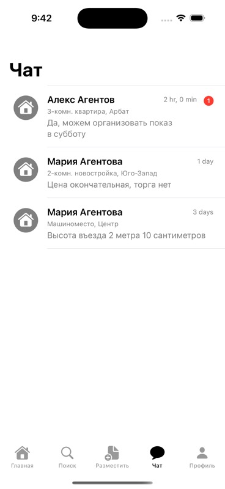
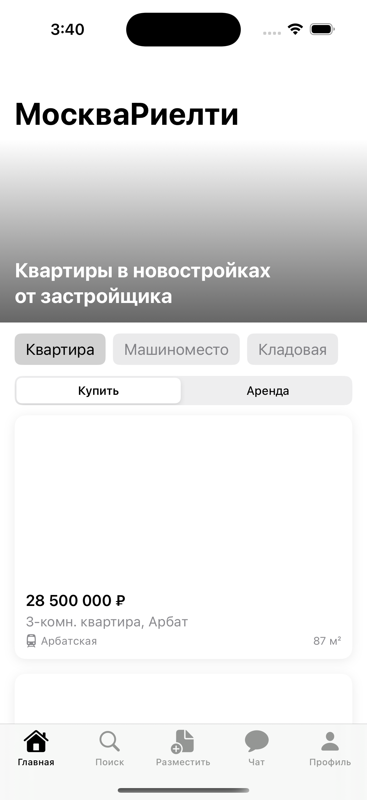

# МоскваРиелти (Moscow Realty)

A Russian-language real estate iOS app built in SwiftUI for iOS 17+, following a Figma design spec. Supports buyer browsing, property search, favorites, and agent listing management.

---

## Screenshots

| Home | Search | Map |
|------|--------|-----|
|  |  | — |

| Post Gate | Chat | Profile |
|-----------|------|---------|
|  |  |  |

---

## Tech Stack

| Layer | Technology |
|-------|------------|
| UI | SwiftUI (iOS 17) |
| Architecture | MVVM-C (`@Observable` coordinators) |
| State | `@Observable` / `@MainActor` ViewModels |
| Navigation | `NavigationPath`-based coordinators |
| Maps | MapKit (iOS 17 `Map` API) |
| Persistence | `UserDefaults` (favorites) |
| Services | Protocol-backed mock services (no backend) |
| Project | XcodeGen (`project.yml`) |
| Tests | XCTest (unit) |

---

## Architecture

### Layer overview

```
┌─────────────────────────────────────────────┐
│                   App                        │
│         MoscowRealtyApp (entry point)        │
│               ↓                              │
│          AppCoordinator                      │
│   (DI root: all 4 service instances)         │
└──────────────────┬──────────────────────────┘
                   │ @Environment(AppCoordinator.self)
          ┌────────┴────────┐
          │   RootTabView    │
          │  5-tab TabView   │
          └────────┬────────┘
                   │
          ┌────────┴───────────────────────────┐
          │       Feature Coordinators          │
          │  MainCoordinator  (Home + Catalog)  │
          │  SearchCoordinator                  │
          │  PostCoordinator                    │
          │  ChatCoordinator                    │
          │  ProfileCoordinator                 │
          └──────────────────────────────────┘
```

### MVVM-C per feature

```
View  ──observes──▶  ViewModel (@Observable @MainActor)
                          │
                     Service layer (protocols)
               ┌──────────┼──────────────────┐
    PropertyService   AuthService    FavoritesService
    (MockProperty     (MockAuth      (UserDefaults)
      Service)          Service)
```

### Navigation model

```
Coordinator (@Observable)
    var path: NavigationPath          ← drives NavigationStack
    func showDetail(_ property)       ← push destination
    func pop()                        ← pop one level
    func popToRoot()                  ← clear path

View
    @Environment(MainCoordinator.self) var coordinator
    NavigationStack(path: Bindable(coordinator).path) { ... }
```

### Auth gate flow

```
App launch
    │
    ├─ authService.currentUser != nil ──▶ RootTabView (main app)
    │
    └─ nil ──▶ AuthFlowView
                    │
                    ├─ LoginView
                    ├─ RegisterBuyerView
                    └─ RegisterAgentView
                              │
                        MockAuthService (seed accounts)
                              │
                        onAuthenticated ──▶ RootTabView
```

### Seed accounts (mock)

| Role | Email | Password |
|------|-------|----------|
| Buyer | `buyer@test.ru` | `password` |
| Agent | `agent@test.ru` | `password` |

---

## Project Structure

```
MoscowRealty/
├── App/
│   ├── MoscowRealtyApp.swift        ← @main, creates AppCoordinator
│   ├── RootTabView.swift            ← 5-tab shell
│   ├── AuthFlowView.swift           ← auth gate
│   └── PostAuthGateView.swift       ← agent-only post gate
├── Coordinators/
│   ├── AppCoordinator.swift         ← DI root, holds all services
│   ├── MainCoordinator.swift        ← Home + Catalog navigation
│   ├── SearchCoordinator.swift
│   ├── PostCoordinator.swift
│   ├── ChatCoordinator.swift
│   └── ProfileCoordinator.swift
├── Core/
│   ├── Models/Property.swift        ← Property, PropertyType, ListingType
│   ├── ViewState.swift              ← ViewState<T> generic enum
│   └── Environment/AppEnvironment.swift  ← EnvironmentKey DI
├── Features/
│   ├── Home/        View + ViewModel
│   ├── Catalog/     View (CatalogMapView)
│   ├── Search/      View + Model (SearchFilter, SearchFilterSheet)
│   ├── PropertyDetail/ View
│   ├── Chat/        View + Model (ChatThread, ChatMessage)
│   ├── Auth/        View + Model (AppUser, AuthError)
│   ├── Agent/       View (AddListingView)
│   └── Profile/     View
├── Services/
│   ├── PropertyServiceProtocol.swift
│   ├── AuthServiceProtocol.swift
│   ├── ChatServiceProtocol.swift
│   ├── FavoritesServiceProtocol.swift
│   ├── FavoritesService.swift       ← real UserDefaults persistence
│   ├── MockPropertyService.swift    ← 10 seed properties
│   ├── MockAuthService.swift        ← seed buyer + agent accounts
│   └── MockChatService.swift        ← 3 seed chat threads
MoscowRealtyTests/
├── Models/
│   ├── PropertyModelTests.swift
│   └── AuthModelTests.swift
├── Services/
│   └── FavoritesServiceTests.swift
└── ViewModels/
    └── HomeViewModelTests.swift
```

---

## Setup

### Prerequisites

- Xcode 16+, iOS 17 simulator
- [XcodeGen](https://github.com/yonaskolb/XcodeGen): `brew install xcodegen`

### Steps

```bash
git clone <repo>
cd moscow-realty-ios-swiftui

xcodegen generate          # regenerates MoscowRealty.xcodeproj
open MoscowRealty.xcodeproj
```

Select an iPhone 17 Pro simulator and press **Run**.

---

## Running Tests

```bash
xcodebuild test \
  -project MoscowRealty.xcodeproj \
  -scheme MoscowRealty \
  -destination "platform=iOS Simulator,name=iPhone 16 Pro" \
  2>&1 | grep -E "(Test Suite|passed|failed|error)"
```

All 18 tests pass (models, services, view models).
