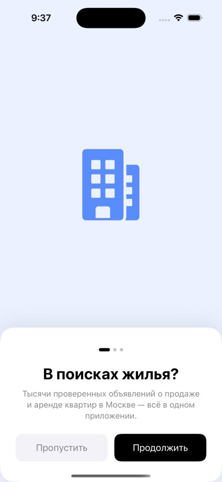
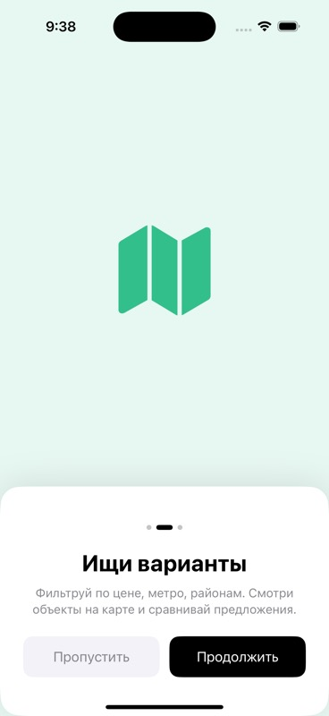
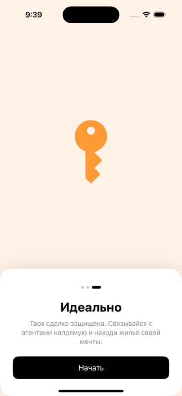
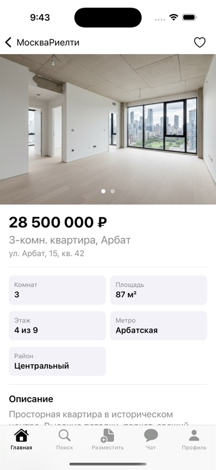
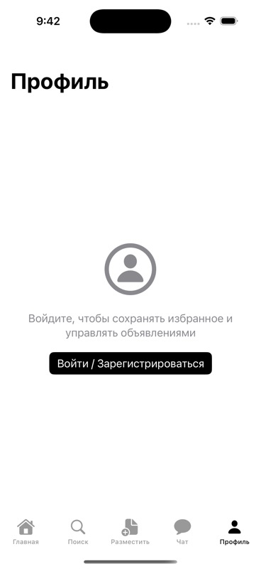
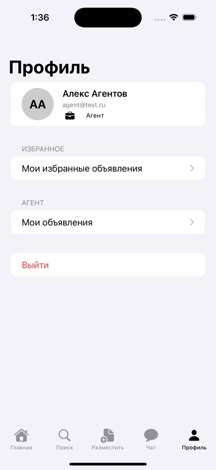
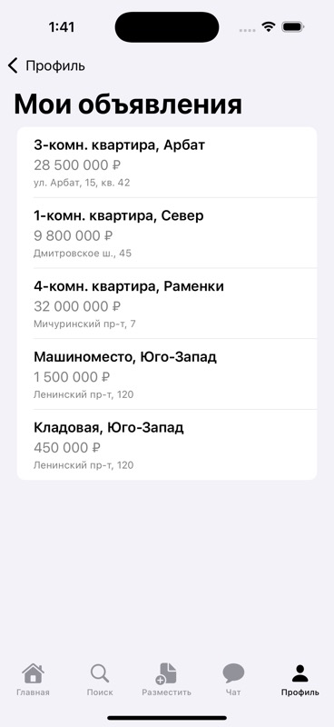
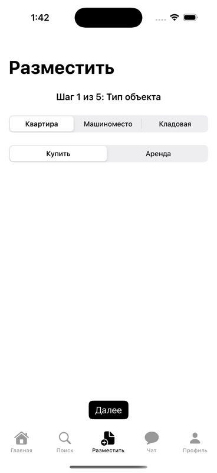

# МоскваРиелти (Moscow Realty)

A Russian-language real estate iOS app built in SwiftUI for iOS 17+, following a Figma design spec. Supports buyer browsing, property search, favorites, agent listing management, and in-app chat.

---

## Screenshots

### Onboarding

| Slide 1 | Slide 2 | Slide 3 |
|---------|---------|---------|
|  |  |  |

### Main App

| Home | Search | Property Detail |
|------|--------|----------------|
|  |  |  |

| Post Gate | Chat | Profile (logged out) |
|-----------|------|----------------------|
|  |  |  |

### Authenticated Views

| Profile (Agent) | Agent Dashboard | Add Listing |
|-----------------|-----------------|-------------|
|  |  |  |

---

## Tech Stack

| Layer | Technology |
|-------|------------|
| UI | SwiftUI (iOS 17) |
| Architecture | MVVM-C (`@Observable` coordinators) |
| State | `@Observable` / `@MainActor` ViewModels |
| Navigation | `NavigationPath`-based coordinators |
| Maps | MapKit (iOS 17 `Map` API) |
| Persistence | `UserDefaults` (favorites + onboarding flag) |
| Services | Protocol-backed mock services (no backend) |
| Project | XcodeGen (`project.yml`) |
| Tests | XCTest (unit) |

---

## Architecture

### Layer overview

```
┌─────────────────────────────────────────────┐
│                   App                        │
│         MoscowRealtyApp (entry point)        │
│               ↓                              │
│   hasSeenOnboarding? ──no──▶ OnboardingView  │
│        │ yes                                 │
│        ▼                                     │
│          AppCoordinator                      │
│   (DI root: all 4 service instances)         │
└──────────────────┬──────────────────────────┘
                   │ @Environment(AppCoordinator.self)
          ┌────────┴────────┐
          │   RootTabView    │
          │  5-tab TabView   │
          └────────┬────────┘
                   │
          ┌────────┴───────────────────────────┐
          │       Feature Coordinators          │
          │  MainCoordinator  (Home + Catalog)  │
          │  SearchCoordinator                  │
          │  PostCoordinator                    │
          │  ChatCoordinator                    │
          │  ProfileCoordinator                 │
          └──────────────────────────────────┘
```

### MVVM-C per feature

```
View  ──observes──▶  ViewModel (@Observable @MainActor)
                          │
                     Service layer (protocols)
               ┌──────────┼──────────────────┐
    PropertyService   AuthService    FavoritesService
    (MockProperty     (MockAuth      (UserDefaults)
      Service)          Service)
```

### Navigation model

```
Coordinator (@Observable)
    var path: NavigationPath          ← drives NavigationStack
    func showDetail(_ property)       ← push destination
    func pop()                        ← pop one level
    func popToRoot()                  ← clear path

View
    @Environment(MainCoordinator.self) var coordinator
    NavigationStack(path: Bindable(coordinator).path) { ... }
```

### Seed accounts (mock)

| Role | Email | Password |
|------|-------|----------|
| Buyer | `buyer@test.ru` | `password` |
| Agent | `agent@test.ru` | `password` |

---

## Project Structure

```
MoscowRealty/
├── App/
│   ├── MoscowRealtyApp.swift        ← @main, onboarding gate
│   ├── RootTabView.swift            ← 5-tab shell
│   ├── AuthFlowView.swift           ← auth sheet (login/register)
│   └── PostAuthGateView.swift       ← agent-only post gate
├── Coordinators/
│   ├── AppCoordinator.swift         ← DI root, holds all services
│   ├── MainCoordinator.swift        ← Home + Catalog navigation
│   ├── SearchCoordinator.swift
│   ├── PostCoordinator.swift
│   ├── ChatCoordinator.swift
│   └── ProfileCoordinator.swift
├── Core/
│   ├── Models/Property.swift        ← Property, PropertyType, ListingType
│   ├── ViewState.swift              ← ViewState<T> generic enum
│   └── Environment/AppEnvironment.swift  ← EnvironmentKey DI
├── Features/
│   ├── Onboarding/  OnboardingView (3-slide, UserDefaults gate)
│   ├── Home/        View + ViewModel (filter chips, 2-column grid)
│   ├── Catalog/     CatalogMapView (MapKit annotations)
│   ├── Search/      View + Model (SearchFilter, SearchFilterSheet)
│   ├── PropertyDetail/ View
│   ├── Chat/        View + Model (ChatThread, ChatMessage)
│   ├── Auth/        View + Model (AppUser, AuthError)
│   ├── Agent/       AddListingView + AgentDashboardView
│   ├── Favorites/   FavoritesView
│   └── Profile/     ProfileView + ProfileViewModel
├── Services/
│   ├── PropertyServiceProtocol.swift
│   ├── AuthServiceProtocol.swift
│   ├── ChatServiceProtocol.swift
│   ├── FavoritesServiceProtocol.swift
│   ├── FavoritesService.swift       ← real UserDefaults persistence
│   ├── MockPropertyService.swift    ← 10 seed properties
│   ├── MockAuthService.swift        ← seed buyer + agent accounts
│   └── MockChatService.swift        ← 3 seed chat threads
MoscowRealtyTests/
├── Models/
│   ├── PropertyModelTests.swift
│   └── AuthModelTests.swift
├── Services/
│   └── FavoritesServiceTests.swift
└── ViewModels/
    ├── HomeViewModelTests.swift
    ├── AgentDashboardViewModelTests.swift
    └── AddListingViewModelTests.swift
```

---

## Features

- **Onboarding** — 3-slide intro on first launch (UserDefaults flag)
- **Home** — Figma-matched layout: 4 filter chips (type, property, rooms, price), metro search bar, "Показать" button, 2-column grid split by Аренда / Покупка
- **Search** — full-text + filter by price, area, metro, rooms
- **Map** — MapKit property pins with tap-to-preview card
- **Property Detail** — photo gallery, specs grid, map, contact agent button
- **Chat** — real-time-style message threads with mock data
- **Agent Dashboard** — swipe-to-delete/edit, empty state
- **Add Listing** — 5-step form (type → location → details → photos → confirm)
- **Profile** — logged-out gate + logged-in view with favorites, agent section, logout
- **Favorites** — heart toggle persisted to UserDefaults

---

## Setup

### Prerequisites

- Xcode 16+, iOS 17 simulator
- [XcodeGen](https://github.com/yonaskolb/XcodeGen): `brew install xcodegen`

### Steps

```bash
git clone <repo>
cd moscow-realty-ios-swiftui

xcodegen generate          # regenerates MoscowRealty.xcodeproj
open MoscowRealty.xcodeproj
```

Select an iPhone 16 Pro simulator and press **Run**.

---

## Running Tests

```bash
xcodebuild test \
  -project MoscowRealty.xcodeproj \
  -scheme MoscowRealty \
  -destination "platform=iOS Simulator,name=iPhone 16 Pro" \
  2>&1 | grep -E "(Test Suite|passed|failed|error)"
```

All tests pass (models, services, view models).
